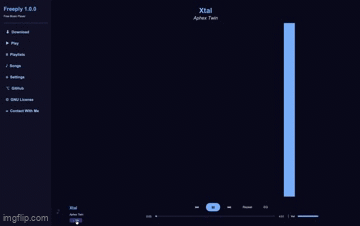

# Freeply 🎵



**Freeply** is a highly customizable, lightweight music player built with Python. Designed for users who want a personalized listening experience, it combines simplicity with the flexibility of Python scripting.

---

## ✨ Features

- 🎨 **Customizable Themes** — 10 built-in colour themes (Grape, Midnight, Forest, Sunset, Arctic, Rose, Charcoal, Gold, Crimson, Ember)
- ⚡ **Lightweight & Fast** — Minimal resource usage for a smooth background music experience
- 🎵 **Format Support** — Play `.mp3`, `.wav`, `.flac`, `.aac`, `.m4a`, `.ogg` and other popular audio formats
- ⬇️ **YouTube Downloader** — Download any song from YouTube as MP3 directly into your library
- 🎚️ **Equalizer** — Bass, Mid and Treble controls with presets (Flat, Bass+, Treble+, Pop, Rock, Jazz)
- 📊 **Audio Visualiser** — Real-time FFT visualiser with an expandable fullscreen mode
- 🔊 **Volume Control** — Inline volume slider in the player bar
- 🔁 **Repeat Mode** — Loop the current track
- 🔍 **Search with Highlight** — Search your library with colour-highlighted results
- 🎤 **Artist & Title Display** — Automatic `Artist — Title` parsing from filenames
- 🌀 **Marquee Titles** — Long song names scroll smoothly like Spotify
- 🖥️ **Cross-Platform** — Windows, macOS and Linux

---

## 📂 Project Structure

```
Freeply/
├── Freeply.py          ← Main application entry point
├── SetSettings.py      ← Theme settings window
├── Settings/
│   └── settings.py     ← Colours, fonts, active theme
├── Musics/             ← Your music files go here (auto-created)
└── README.md           ← Project documentation
```

---

## 🚀 Installation

> **Start from scratch? No problem.** Follow the section for your operating system below.

---

### 🪟 Windows

#### 1. Install Python

1. Go to [python.org/downloads](https://www.python.org/downloads/)
2. Download the latest Python 3 installer
3. Run the installer — **check "Add Python to PATH"** before clicking Install
4. Verify in **Command Prompt**:
   ```
   python --version
   ```

#### 2. Install ffmpeg

1. Go to [ffmpeg.org/download.html](https://ffmpeg.org/download.html)
2. Download the latest Windows build (e.g. from **gyan.dev**)
3. Extract the zip (e.g. to `C:\ffmpeg`)
4. Add ffmpeg to PATH:
   - Search **"Edit the system environment variables"** in Start
   - Click **Environment Variables → Path → Edit → New**
   - Add the path to the `bin` folder (e.g. `C:\ffmpeg\bin`)
   - Click **OK** on all dialogs
5. Verify in a **new** Command Prompt window:
   ```
   ffmpeg -version
   ```

#### 3. Clone the Repository

```
git clone https://github.com/feriduntahakurt0/freeply.git
cd freeply
```

Or download the ZIP from GitHub and extract it.

#### 4. Install Dependencies

```
pip install customtkinter pygame mutagen numpy yt-dlp pydub scipy
```

#### 5. Run Freeply

```
python Freeply.py
```

---

### 🍎 macOS

#### 1. Install Homebrew (if not installed)

```bash
/bin/bash -c "$(curl -fsSL https://raw.githubusercontent.com/Homebrew/install/HEAD/install.sh)"
```

#### 2. Install Python

```bash
brew install python
python3 --version
```

#### 3. Install ffmpeg & SDL2

```bash
brew install ffmpeg sdl2 sdl2_image sdl2_mixer sdl2_ttf
```

#### 4. Clone the Repository

```bash
git clone https://github.com/feriduntahakurt0/freeply.git
cd freeply
```

#### 5. Create a Virtual Environment (Recommended)

```bash
python3 -m venv .venv
source .venv/bin/activate
```

#### 6. Install Dependencies

```bash
pip install customtkinter pygame mutagen numpy yt-dlp pydub scipy
```

#### 7. Run Freeply

```bash
python3 Freeply.py
```

---

### 🐧 Linux (Ubuntu / Debian)

#### 1. Install Python & pip

```bash
sudo apt update
sudo apt install python3 python3-pip python3-venv
```

#### 2. Install System Dependencies

```bash
sudo apt install ffmpeg libsdl2-dev libsdl2-mixer-dev libsdl2-image-dev libsdl2-ttf-dev
```

#### 3. Clone the Repository

```bash
git clone https://github.com/feriduntahakurt0/freeply.git
cd freeply
```

#### 4. Create a Virtual Environment (Recommended)

```bash
python3 -m venv .venv
source .venv/bin/activate
```

#### 5. Install Dependencies

```bash
pip install customtkinter pygame mutagen numpy yt-dlp pydub scipy
```

#### 6. Run Freeply

```bash
python3 Freeply.py
```

---

## 📦 Python Dependencies

| Package | Purpose | Required? |
|---------|---------|-----------|
| `customtkinter` | UI framework | ✅ Yes |
| `pygame` | Audio playback | ✅ Yes |
| `mutagen` | Song duration detection | ✅ Yes |
| `numpy` | Visualiser & EQ processing | ⚡ Recommended |
| `yt-dlp` | YouTube downloading | ⚡ Recommended |
| `pydub` | Fast audio decoding for EQ | ⚡ Recommended |
| `scipy` | High-performance EQ filters | ⚡ Recommended |

> Packages marked ⚡ are optional but strongly recommended. Without `numpy` the visualiser falls back to an animated display. Without `yt-dlp` the Download page will not work.

---

## 🎨 Changing the Theme

1. Click **Settings** in the sidebar (or run `SetSettings.py` directly)
2. Pick a colour theme from the grid
3. Click **Save & Restart** — Freeply restarts with the new theme applied

---

## ❓ Troubleshooting

| Problem | Solution |
|---------|----------|
| `ModuleNotFoundError` | Re-run the pip install command |
| `pygame` won't initialise on macOS | Run `brew install sdl2 sdl2_mixer` |
| Download fails — "ffmpeg not found" | ffmpeg is not in PATH — re-check Step 2 |
| Blank content area on launch | Run the script from inside the Freeply folder |
| EQ causes audio lag | Install `scipy` and `pydub`: `pip install scipy pydub` |

---

## 📬 Contact

Questions, bug reports or just want to say hello?

📧 **feriduntahakurt@gmail.com**

---

## 📜 License

Freeply is released under the [GNU General Public License v3.0](https://www.gnu.org/licenses/gpl-3.0.html).
